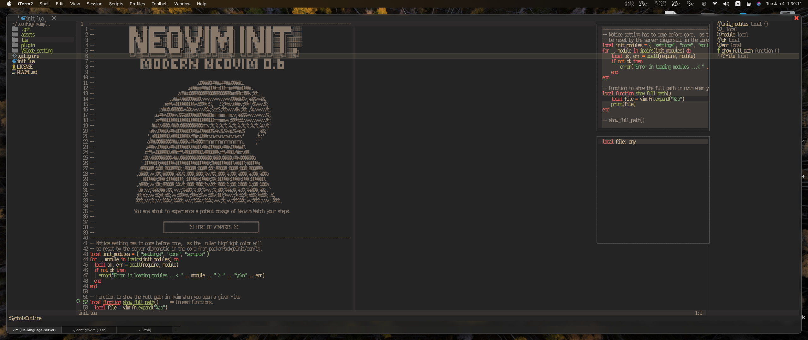
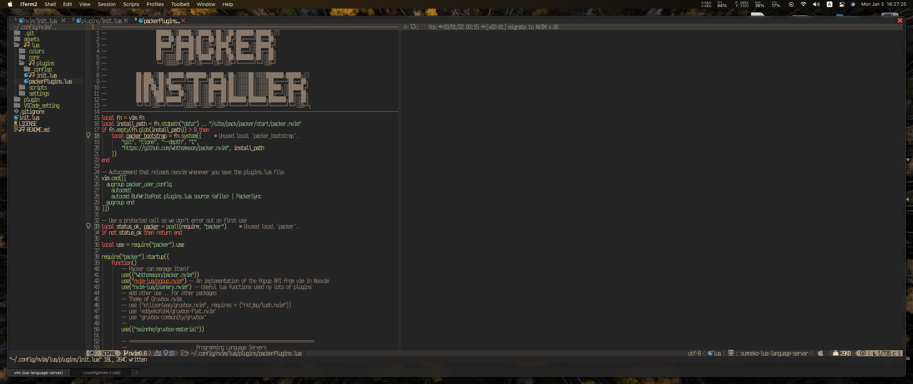
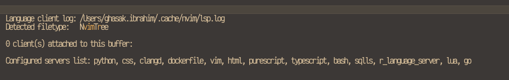

# Neovim Configurations File (build v.02)

## What is new?

As `nvim` is now updated to version `0.6` with a stable release. The plugin
`nvim-telescope` has no backward compatibility and require only `nvim 0.6+`.
Therefore, it is time to upgrade the configuration file of `init.lua`. The
native `nvim` module of `nvim-lsp` has become `nvim-diagonstics`, the built-in
APIs are now different, which many other third-party-plugins haven't been
supported yet. In this repository, I have migrated to the new `Nvim 0.6`, after
fixing the `lsp-saga`, this including the `lsp-signture` which are both
now working synchronously with the `lsp-connfig`. Features in this migration
are, to name few:

- Now all packages are supported with the `NVIM v.06+`.
- Some compatibility issues are now fixed with the `lsp-configs`, especially
  passing the `custom_attach`, `handler`, and `compatibility` to the
  `nvim-lsp-installer` setup API.
- [Manually] Adding a backup script to the `.local/share/nvim`, which will
  allow us to experiment with new plugins or try new features without affecting
  the main branch of our daily driver (just to retrieve any version to my
  current `nvim IDE`.)
- Adding branches to the `~/.config/nvim/`, for each version, also a branch
  called `feature/dev` to check and try any new feature or package.

### About Branch and GitHub
Once you have updated the `main` branch (change, modify, create ... etc.)
The current working flow to address such updates with my `main` repo is:

1. On the main branch, `git add --> git commit --> git push `, you will get your
   `main` branch in the `remote` repository at `GitHub` to the latest comments.

2. Switch to the release branch currently I am using the `nvim0.6` branch, using
   `git checkout nvim0.6`,
  - git merge main
  - git add -a
  - git commit -m "some message"
  - git push

3. On GitHub main repo. You will see that your pull request to merge with the
   main doesn't appear, the reason is that your `main branch` becomes an
   identical copy to our `nvim0.6 branch`.

## Contents
The following configurations are based on `lua` with `nvim` as my daily-working
environment. Nowadays, the main `nvim` developers team have recommended using
`lua scripting language` for the configurations file, namely the `init.lua`
instead of `init.vim` with vim scripting.




#### General notes

The current configurations are a mix of common keys from my old configurations
with `COC and COC-LSP` and my current one with `nvim-lsp`.

- For key-mapping you can check any key that affects your cursor movements
  among the opened buffers, simple use `:map <key>`, or `verbose map` to see
  all the key-mappings.
- To check the registers, I usually use `:reg`.
- There are a few setting explanations that I haven't included yet in the
  following table.

#### DAILY COMMANDS

| T   | Command                  | Descriptions                                                                                                                          | Reference  |
| --- | ------------------------ | ------------------------------------------------------------------------------------------------------------------------------------- | ---------- |
| 1   | HOME                     | Got to Stratify home page                                                                                                             |            |
| 2   | bd                       | close a buffer                                                                                                                        |
| 3   | leader + cc/cu           | Comment and uncomment                                                                                                                 | deprecated |
| 4   | Tab                      | navigate among buffers                                                                                                                |            |
| 5   | g + d                    | Go to definition                                                                                                                      |            |
| 6   | Ctrl + o                 | back from definition                                                                                                                  |            |
| 7   | F1                       | show function helper                                                                                                                  |            |
| 8   | Leader + ff              | fuzzy search for a given word                                                                                                         |
| 1   | HOME                     | Go to Stratify home                                                                                                                   |            |
| 2   | bd                       | close a buffer                                                                                                                        |            |
| 3   | Leader + cc /cu          | Commend and uncommon                                                                                                                  |            |
| 4   | Tab                      | Navigate between buffers                                                                                                              |            |
| 5   | g + d                    | Go to definition                                                                                                                      |            |
| 6   | CTRL + o                 | back from definition                                                                                                                  |            |
| 7   | Fn + F1                  | Go to description of the given function (python tested)                                                                               |            |
| 8   | Leader + ff              | Fuzzy search for a given word in your given directory                                                                                 |            |
| 9   | FZF / FILES              | Command to search for a file                                                                                                          |            |
| 10  | Leader + r               | Ranger                                                                                                                                |            |
| 11  | Leader + t               | floating Terminal                                                                                                                     |            |
| 12  | :CocList marketplace     | Search for a a plug for coc, use CTRL + o to go to Normal mode then use Space to multi-selection then tab to finish and use (install) |            |
| 13  | :CocCommand python.+TAB  | you can find setup for formatter, `linter`, ..etc                                                                                      |            |
| 14  | :CocConfig               | To see the configuration of COC                                                                                                       |            |
| 16  | :Rg                      | Regular expression searching for a word in terminal                                                                                   |            |
| 17  | :%s/\<Plug\>/Plugin/gc   | Regular Expression searching specific word exclusively and as for change one by one                                                   |            |
| 18  | Using coc-telescope      | you have (leader + ff , leader + fg)                                                                                                  |            |
| 19  | using MYReg              | For regular expression search                                                                                                         |            |
| 20  | :leader + m              | for markdown viewer (using glow)                                                                                                      |
| 21  | :leader + s              | Save and source your init.vim file                                                                                                    |            |
| 22  | :leader + ,              | To open the configuration file (init.vim)                                                                                             |            |
| 23  | :leader + e              | Open coc-explorer better than nerdTree                                                                                                |            |
| 24  | :leader + u              | UndoTree                                                                                                                              |            |
| 25  | using F5                 | Open `ipython` and run the script you have                                                                                              |            |
| 26  | :index                   | To see all key maps                                                                                                                   |            |
| 27  | F1                       | See hover of definition with coc                                                                                                      |            |
| 28  | d0 or d^                 | Delete to beginning of line from the cursor position                                                                                  |            |
| 29  | dgg and dG               | delete to beginning of page and end of page from the position of your cursor.                                                         |            |
| 30  | leader + c +r then i + w | i + w means inside word, this will allow to replace a word that copied in the register with a given word (you need a plugin)          |            |
| 31  | v + i + w then p         | Achieve the same thing but not repeated like the one above                                                                            |            |
| 32  | c + s + " + '            | this will work as change the surrender (you need a plugin)                                                                            |            |
| 33  | :Markdown_preview        | Toggle markdown using browser (not like glow)                                                                                         |
| 34  | double ""                | in normal mode (double ") will give us the terminal of the register                                                                   |
| 35  | :SymbolOutlines          | Open the symbol-outline menu for fast coding movements                                                                                 |
| 36  | :Trouble                 | Code diagnostic with nice layouts                                                                                                     |
| 37  | :Ctrl-\                  | open quick terminal written in lua super fast.                                                                                        |
| 38  | ~                        | changing the letter (Capital to small letter)                                                                                         |
| 39  | gr                       | replace with register yanking then paste (repeatable)                                                                                 |
| 40  | gy                       | re-mapping to lsp-config for show references                                                                                          |
| 41  | grr                      | form lspsaga replace the work with a given sentence.                                                                                  |            |
| 42  | leader t+m               | `Activite` the table mode                                                                                                               |            |
| 43  | leader b+n               | Open terminal horizontally                                                                                                            |            |
| 44  | leader g d               | go to definition in nvim-lsp built-in, while (g d) will be using lspSaga                                                              |            |
| 45  | g  h                     | hover with `lspsaga`, while F1 hover using `nvim-lsp` built-in.                                                                           |            |

---

### Requirements
The requirements that I am looking for in my IDE are: **note**, check sign means already implemented.

- [x] Supporting a native `lua-lsp` with `nvim 6.0+`.
  - `Intellisense` support (very important feature).
  - `Diagnostic` for
    - errors,
    - hover on error,
    - show implementation,
    - jump to definition,
    - code action suggestions (such as `Lspsaga` and `lsp-signture`).
- [x] All language servers `LPS` that I need on daily basis, (`lua`, `python`, `R` , `javascript`, `shell`, `rust`, `C++` and `Julia`)
- [x] Support for data-science paradigms and tools, including the `Jupyter-notebook`, `debugger` with `Jupyter-notebook` ... etc.
- [x] Fully customizable with each piece of code I know its purpose and its effect.

### To do

- [x] Adding `dap` for `python`, `lua`, `js` and `R`.
- [x] Optimize the performance of the launched packages with events, `cmd`, `impatient` plugin and `lazy-loading`.
- [x] Adding `org mode`, `to-do` list and some other interesting plugins.
- [x] Automate `lua` coding with optimized `nvim` scripts for on-first installation and on-first launching,
      (such as changing the packer-compiled directory with packer.init(), up to
      now, the `nvim` will not automated to recompiled on attach, need manually to
      compile).

- [x] Adding `auto commenting` Lines.
- [ ] Adding `multi-cursors` support
- [ ] Save session with `nvim`.
- [x] Debugging support for each programming language in our LSP list.

### Setup Lua, that already I transfer from previous vim with coc-setting.

Things to be included in my current developed branch.

- [x] Syntax highlighting
- [x] Snippets
- [x] TreeSitter
- [x] Jump to definition
- [x] Show definition on hover
- [x] Show Implementations.
- [x] Show reference
- [x] Theme
  - Status-line with `lua` support (in favor of `airline` it is a bit slower)
  - Global theme (already automated)
  - Customizing the icons
- [x] Floating terminal
- [x] Show ranger
- [x] Check spelling
- [x] Show directory and location within the given scope
- [x] Show down terminal (terminal not float, stay opened)
- [x] Update on change with other editor (Running a script on fly)
- [x] Dashboard and Dashboard Customization.
- [x] `Tab` configurations.
- [x] Moving block of code on request.
- [x] Navigate using `ctrl + j` and `k` for `omini-windows`.
- [x] Installing `CCC-Server`, but not conflict with our `nvim-lspconfig` language-servers, (this feature is not required anymore with `lsp-config.lua`).

#### Things to be considered

You will need the following necessary packages

- `nvim-lspconfig` for `language-server`.
- `nvim-lsp` language installer (adding install a specific language)
- `Lua language server` for `luajit` installed up-and-running.
- `Lua configuration` with formatting.
- `lspsaga`, `lspinstall` and `lsp-signture`.

#### Setup packer

For more information on `Packer package manager` see:
- [packer](https://github.com/wbthomason/packer.nvim).
- `Packer` now support `on-save` `sync and loading` modules.


## Building Nvim from Scratch requires:

- Install `Lua LSP-language server` from scratch (without `nvim-lsp-install`)
- Configure Lua `LSP-Language server`
- Auto completions with `CMP` plugin.
- Lua formatter
- Programming language servers



There are several `formatters` available, that we can add to format our `lua` code such as `luaformatter`, `stylua` ... etc.
To install `stylua` ensure you have already `Cargo` and `Rust` language installed on your machine.

```sh
cargo install stylua
luarocks install --server=https://luarocks.org/dev luaformatter
```

# Useful information

## Testing the speed of neovim launching time.

Use the command `vim-startuptime` which will offer a quick calculation of the launching time.

- For my private `MacBook`, I used the custom binary (pre-built) with `vim-startuptime_darwin_amd64.zip`
- [vim-startuptime website](https://github.com/rhysd/vim-startuptime)
- Right now, I used individual location for my `nvim`, that I installed it manually at `$HOME/dev/bin/nvim`
- [Neovim build from the source](https://github.com/neovim/neovim/wiki/Building-Neovim)
- `Plugins directory` will be at same directory of our `nvim`, I have tried to change this directory, but it causes many problems. When you do a fresh installation, ensure you have removed these old directories:
  - ~/.config/plugin
  - ~/.local/share/nvim

## Creating file or directory in vim without plugin

### Formula

1. In the command prompt of `Nvim`, you can use the following configurations.

```shell
! cd /directory/direcotyr_2/direcotry_3
! mkdir <name>
! touch <name>.extention
```

2. Accessing the prompt to open browser

```shell
!open -a "Safari" <link, e.g www.google.com>
```

## Changing the nvim-clap theme color

- Requirements for `nvim-clap`, [no longer are needed since I am using `tree-sitter` anyway]

```sh
vim.cmd[[let g:clap_theme = 'material_design_dark']]
```

- [x] ~/.local/share/nvim/site/pack/packer/start/vim-clap/autoload/clap/themes/material_design_dark.vim.modified.now.used
- Simply changed the color of the background to fit my terminal.

```sh
" Author: liuchengxu <xuliuchengxlc@gmail.com>
" Description: Clap theme based on the material_design_dark theme."
let s:save_cpo = &cpoptions
set cpoptions&vim
let s:palette = {}
let s:palette.display = { 'ctermbg': '235', 'guibg': '#424242' }
" Let ClapInput, ClapSpinner and ClapSearchText use the same background.
let s:bg0 = { 'ctermbg': '60', 'guibg': '#424242' }
let s:palette.input = s:bg0
let s:palette.indicator = extend({ 'ctermfg': '238', 'guifg':'#676b83' }, s:bg0)
let s:palette.spinner = extend({ 'ctermfg': '11', 'guifg':'#ffe500', 'cterm': 'bold', 'gui': 'bold'}, s:bg0)
let s:palette.search_text = extend({ 'ctermfg': '195', 'guifg': '#CADFF3', 'cterm': 'bold', 'gui': 'bold' }, s:bg0)
let s:palette.preview = { 'ctermbg': '238', 'guibg': '#424242' }
let s:palette.selected = { 'ctermfg': '81', 'guifg': '#5FD7d7', 'cterm': 'bold,underline', 'gui': 'bold,underline' }
let s:palette.current_selection = { 'ctermbg': '236', 'guibg': '#31364D', 'cterm': 'bold', 'gui': 'bold' }
let s:palette.selected_sign = { 'ctermfg': '196', 'guifg': '#f2241f' }
let s:palette.current_selection_sign = s:palette.selected_sign
let g:clap#themes#material_design_dark#palette = s:palette
let &cpoptions = s:save_cpo
unlet s:save_cpo
```

## Checking my key-mapping with
You can use `:verbouse map`, or `:Telescope keymaps`, to check all the key bindings.

## Spell checking
For spell checking, I am using the 'kamykn/spelunker.vim', and mapped the (ZL
and Zl) for checking the spelling. This is less attractive compared to the
`nvim spell checking` from `COC`.

## Fuzzy Finding

One of the coolest feature that has been implemented is the `fuzzy finder` in
`lua`. For all the features that comes with the `Fuzzy Finder`, it allows
also to get the `path` (directory in string form similar to the `VSCode` plugin).

- The mapping is located at `lua/scripts/myCommandWrapper.lua`, which will be
  triggered in the `insert mode` with (`CTR-X`, then `CTRL-F`). It will automatically
  complete the path while coding, while you are searching for any specific
  word. This feature is still existed, but now we have `cmp-path` plugin which
  is much better for this particular task.

- [Idea got it from](https://vi.stackexchange.com/questions/34392/path-completion-with-fzf-from-absolute-path)
  you will need the following plugins:

```shell
  use{'junegunn/fzf', run = "fzf#install()"}
  use{'junegunn/fzf.vim'}
```

- [`FZY` finder repository](https://github.com/junegunn/fzf.vim)

## Commands

| Command           | List                                                                                  |
| ----------------- | ------------------------------------------------------------------------------------- |
| `:Files [PATH]`   | Files (runs `$FZF_DEFAULT_COMMAND` if defined)                                        |
| `:GFiles [OPTS]`  | Git files (`git ls-files`)                                                            |
| `:GFiles?`        | Git files (`git status`)                                                              |
| `:Buffers`        | Open buffers                                                                          |
| `:Ag [PATTERN]`   | [ag][ag] search result (`ALT-A` to select all, `ALT-D` to deselect all)               |
| `:Rg [PATTERN]`   | [rg][rg] search result (`ALT-A` to select all, `ALT-D` to deselect all)               |
| `:Colors`         | Color schemes                                                                         |
| `:Lines [QUERY]`  | Lines in loaded buffers                                                               |
| `:BLines [QUERY]` | Lines in the current buffer                                                           |
| `:Tags [QUERY]`   | Tags in the project (`ctags -R`)                                                      |
| `:BTags [QUERY]`  | Tags in the current buffer                                                            |
| `:Marks`          | Marks                                                                                 |
| `:Windows`        | Windows                                                                               |
| `:Locate PATTERN` | `locate` command output                                                               |
| `:History`        | `v:oldfiles` and open buffers                                                         |
| `:History:`       | Command history                                                                       |
| `:History/`       | Search history                                                                        |
| `:Snippets`       | Snippets ([UltiSnips][us])                                                            |
| `:Commits`        | Git commits (requires [fugitive.vim][f])                                              |
| `:BCommits`       | Git commits for the current buffer; visual-select lines to track changes in the range |
| `:Commands`       | Commands                                                                              |
| `:Maps`           | Normal mode mappings                                                                  |
| `:Helptags`       | Help tags <sup id="a1">[1](#helptags)</sup>                                           |
| `:Filetypes`      | File types                                                                            |

## How to close your windows without affecting other buffers

You can use `Bdelete`. I have mapped this to `<leader>w`, this will allow to close
the given window without closing all the other buffers.

## Highlight words in vim with (f/t/F/T)

- [vim-eft plugin](https://github.com/hrsh7th/vim-eft)

## Performance and optimization

I have used two types of performance evaluators to check the startup speed by
measuring each individual plugin launching time in milliseconds. First the
`vim-startuptim ` which is assigned with a flag `--vimpath=nvim`. Second, the
`packer profile` with `:PackerProfile
profile=true`. Recently, I have also included a tool that comes with
`impatient` plugin to cache plugins it called `LuaCacheProfile`. The results
are shown below

```shell
  Config for sidebar.nvim took 78.00594ms
  Sequenced loading took 11.807982ms
  packadd for vim-matchup took 1.459474ms
  packadd for nvim-lspinstall took 1.211138ms
  Config for bufferline.nvim took 1.012205ms
```
- Applying a stress test for the launching time for `nvim 0.6` with the new configurations `Thus. Jan. 6th 2022`.
```bash
# Applying
╰ for ((i = 1; i < 10; i++)); do echo "\ue741 \uf432  Trial no. ${i}\n"; vim-startuptime --vimpath=nvim | head -n 4 | grep "Total Average"; done                                                                                                                                                                     祥:7.193s  [   Jan 06, 2022-   1:56:20 PM]
# Results

   Trial no. 1
Total Average: 490.632000 msec
   Trial no. 2
Total Average: 493.893900 msec
   Trial no. 3
Total Average: 497.408600 msec
   Trial no. 4
Total Average: 525.027600 msec
   Trial no. 5
Total Average: 538.629000 msec
   Trial no. 6
Total Average: 583.140500 msec
   Trial no. 7
Total Average: 554.687200 msec
   Trial no. 8
Total Average: 522.458400 msec
   Trial no. 9
Total Average: 506.968300 msec

```

## Some useful API functions

```sh
-- Getting to know the cursor location
local current_line = vim.fn.line(".")
local total_line = vim.fn.line("$")
-- Getting to know the directory , file name, and extension
local filename = vim.fn.expand "%:t"
local extension = vim.fn.expand "%:e"
local extension = vim.fn.expand "%:f"
local extension = vim.fn.expand "%:F"
```

## Table mode in nvim

Using a plugin `vim-table-mode` to create a nice table, need to remember the following

- <leader> tm => is the trigger to the table in markdonw format (\*.md)

#### How it works

1. Enter the first line, delimiting columns by the | symbol. The plugin reacts by inserting spaces between the text and the separator if you omit them:

```shell
| name | address | phone |
```

2. In the second line (without leaving Insert mode), enter | twice. The plugin will write a properly formatted horizontal line:

```shell
| name | address | phone |
|------+---------+-------|
```

3. When you enter the subsequent lines, the plugin will automatically adjust the formatting to match the text you’re entering every time you press |:

| name                        | address             | phone                                          |
| --------------------------- | ------------------- | ---------------------------------------------- |
| Formulate the address first | For on the idea for | Create the right table in material_design_dark |
| This could                  | How about the       | Working on the second objectives               |

# Special Language Servers Configurations.

## Julia LSP

Installing the `Julia-lsp` needs, read from the references `Julia Language Reference`.

- [Julia Language Server] (https://github.com/julia-vscode/julia-vscode)

`LanguageServer.jl` can be installed with `julia` and `Pkg`:

```shell
julia --project=~/.julia/environments/nvim-lspconfig -e 'using Pkg; Pkg.add("LanguageServer")'
```
where `~/.julia/environments/nvim-lspconfig` is the location where the default
configuration expects `LanguageServer.jl` to be installed. To update an
existing install, use the following command:

```shell
julia --project=~/.julia/environments/nvim-lspconfig -e 'using Pkg; Pkg.update()'
```
- **Note**:
In order to have `LanguageServer.jl` pick up installed packages or dependencies
in a Julia project, you must make sure that the project is instantiated:

```shell
julia --project=/path/to/my/project -e 'using Pkg; Pkg.instantiate()'
```
- **Note**
To install the `intractive REPL` of Julia with `jupyter` you can use, inside
the `julia` REPL use `]` to access the `Pkg` the package manager of `nvim`.


## References

- [Reference Num -1-](https://github.com/abzcoding/nvim/blob/main/lua/config/cmp.lua)
  - Got the tab complelation for the cmp pluging
  - Got the neovide configuration if the neovide buffer is launched, instead of sourcing, can be found in (options)
- [Reference Num -2-](https://github.com/alpha2phi/dotfiles/blob/main/config/nvim/lua/plugins.lua)
  I got the set of tpope plugins for developments, with debugging and dap for python and other language-server.
- [Julia Language Reference] (https://github.com/neovim/nvim-lspconfig/blob/master/doc/server_configurations.md#julials)

```sh
-- Debugging
    use { "puremourning/vimspector", event = "BufWinEnter" }

    -- DAP
    use { "mfussenegger/nvim-dap" }
    use { "mfussenegger/nvim-dap-python" }
    use { "theHamsta/nvim-dap-virtual-text" }
    use { "rcarriga/nvim-dap-ui" }
    use { "Pocco81/DAPInstall.nvim" }
    use { "jbyuki/one-small-step-for-vimkind" }
```

